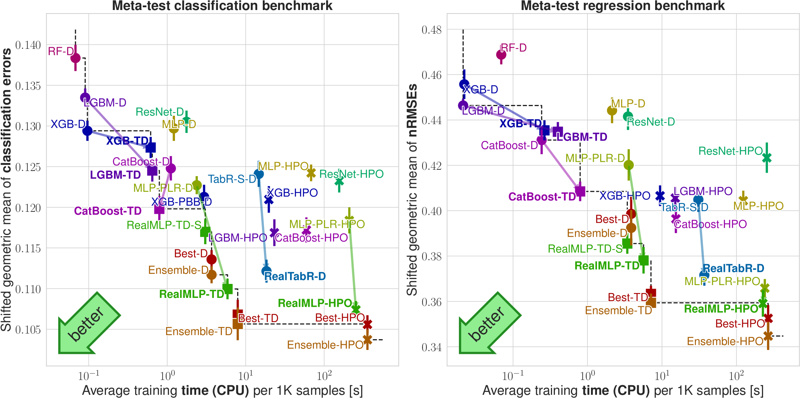

[](https://colab.research.google.com/github/dholzmueller/pytabkit/blob/main/examples/tutorial_notebook.ipynb)
[](https://pytabkit.readthedocs.io/en/latest/)
[](https://github.com/dholzmueller/pytabkit/actions/workflows/testing.yml)
# PyTabKit: Tabular ML models and benchmarking (NeurIPS 2024)

[Paper](https://arxiv.org/abs/2407.04491) | [Documentation](https://pytabkit.readthedocs.io) | [RealMLP-TD-S standalone implementation](https://github.com/dholzmueller/realmlp-td-s_standalone)   | [Grinsztajn et al. benchmark code](https://github.com/LeoGrin/tabular-benchmark/tree/better_by_default) | [Data archive](https://doi.org/10.18419/darus-4555) |
| --- | --- |---------------------------------------------------------------------------------------------|---------------------------------------------------------------------------------------------------------------------------------------------------------------------------------------------------|-----------------------------------------------------|

PyTabKit provides **scikit-learn interfaces for modern tabular classification and regression methods**
benchmarked in our [paper](https://arxiv.org/abs/2407.04491), see below. 
It also contains the code we used for **benchmarking** these methods 
on our benchmarks.



## Installation

```commandline
pip install pytabkit
```
- If you want to use **TabR**, you have to manually install 
[faiss](https://github.com/facebookresearch/faiss/blob/main/INSTALL.md), 
which is only available on **conda**.
- Please install torch separately if you want to control the version (CPU/GPU etc.)
- Use `pytabkit[autogluon,extra,hpo,bench,dev]` to install additional dependencies for 
AutoGluon models, extra preprocessing, 
hyperparameter optimization methods beyond random search (hyperopt/SMAC), 
the benchmarking part, and testing/documentation. For the hpo part, 
you might need to install *swig* (e.g. via pip) if the build of *pyrfr* fails.
See also the [documentation](https://pytabkit.readthedocs.io).
To run the data download for the meta-train benchmark, you need one of rar, unrar, or 7-zip 
to be installed on the system.

## Using the ML models
Most of our machine learning models are directly available via scikit-learn interfaces.
For example, you can use RealMLP-TD for classification as follows:

```python
from pytabkit import RealMLP_TD_Classifier

model = RealMLP_TD_Classifier()  # or TabR_S_D_Classifier, CatBoost_TD_Classifier, etc.
model.fit(X_train, y_train)
model.predict(X_test)
```
The code above will automatically select a GPU if available, 
try to detect categorical columns in dataframes, 
preprocess numerical variables and regression targets (no standardization required),
and use a training-validation split for early stopping. 
All of this (and much more) can be configured through the constructor 
and the parameters of the fit() method. 
For example, it is possible to do bagging 
(ensembling of models on 5-fold cross-validation)
simply by passing `n_cv=5` to the constructor. 
Here is an example for some of the parameters that can be set explicitly:

```python
from pytabkit import RealMLP_TD_Classifier

model = RealMLP_TD_Classifier(device='cpu', random_state=0, n_cv=1, n_refit=0,
                              n_epochs=256, batch_size=256, hidden_sizes=[256] * 3,
                              val_metric_name='cross_entropy',
                              use_ls=False,  # for metrics like AUC / log-loss
                              lr=0.04, verbosity=2)
model.fit(X_train, y_train, X_val, y_val, cat_col_names=['Education'])
model.predict_proba(X_test)
```
See [this notebook](https://colab.research.google.com/github/dholzmueller/pytabkit/blob/main/examples/tutorial_notebook.ipynb)
for more examples. Missing numerical values are currently *not* allowed and need to be imputed beforehand.

### Available ML models

Our ML models are available in up to three variants, all with best-epoch selection: 
- library defaults (D)
- our tuned defaults (TD)
- random search hyperparameter optimization (HPO), sometimes also tree parzen estimator (HPO-TPE)

We provide the following ML models:

- **RealMLP** (TD, HPO): Our new neural net models with tuned defaults (TD) 
or random search hyperparameter optimization (HPO)
- **XGB**, **LGBM**, **CatBoost** (D, TD, HPO, HPO-TPE): Interfaces for gradient-boosted 
tree libraries XGBoost, LightGBM, CatBoost
- **MLP**, **ResNet**, **FTT** (D, HPO): Models from [Revisiting Deep Learning Models for Tabular Data](https://proceedings.neurips.cc/paper_files/paper/2021/hash/9d86d83f925f2149e9edb0ac3b49229c-Abstract.html)
- **MLP-PLR** (D, HPO): MLP with numerical embeddings from [On Embeddings for Numerical Features in Tabular Deep Learning](https://proceedings.neurips.cc/paper_files/paper/2022/hash/9e9f0ffc3d836836ca96cbf8fe14b105-Abstract-Conference.html)
- **TabR** (D, HPO): TabR model from [TabR: Tabular Deep Learning Meets Nearest Neighbors](https://openreview.net/forum?id=rhgIgTSSxW)
- **TabM** (D): TabM model from [TabM: Advancing Tabular Deep Learning with Parameter-Efficient Ensembling](https://arxiv.org/abs/2410.24210)
- **RealTabR** (D): Our new TabR variant with default parameters
- **Ensemble-TD**: Weighted ensemble of all TD models (RealMLP, XGB, LGBM, CatBoost)

## Benchmarking code

Our benchmarking code has functionality for
- dataset download
- running methods highly parallel on single-node/multi-node/multi-GPU hardware,
with automatic scheduling and trying to respect RAM constraints
- analyzing/plotting results

For more details, we refer to the [documentation](https://pytabkit.readthedocs.io).

## Preprocessing code

While many preprocessing methods are implemented in this repository, 
a standalone version of our robust scaling + smooth clipping 
can be found [here](https://github.com/dholzmueller/realmlp-td-s_standalone/blob/main/preprocessing.py#L65C7-L65C37).

## Citation

If you use this repository for research purposes, please cite our [paper](https://arxiv.org/abs/2407.04491):
```
@inproceedings{holzmuller2024better,
  title={Better by default: {S}trong pre-tuned {MLPs} and boosted trees on tabular data},
  author={Holzm{\"u}ller, David and Grinsztajn, Leo and Steinwart, Ingo},
  booktitle = {Neural {Information} {Processing} {Systems}},
  year={2024}
}
```

## Contributors

- David Holzmüller (main developer)
- Léo Grinsztajn (deep learning baselines, plotting)
- Ingo Steinwart (UCI dataset download)
- Katharina Strecker (PyTorch-Lightning interface)
- Lennart Purucker (some features/fixes)
- Jérôme Dockès (deployment, continuous integration)

## Acknowledgements
Code from other repositories is acknowledged as well as possible in code comments. 
Especially, we used code from https://github.com/yandex-research/rtdl 
and sub-packages (Apache 2.0 license),
code from https://github.com/catboost/benchmarks/
(Apache 2.0 license), 
and https://docs.ray.io/en/latest/cluster/vms/user-guides/community/slurm.html 
(Apache 2.0 license).

## Releases (see git tags)

- v1.1.3:
  - Fixed a bug where the categorical encoding was incorrect if categories 
    were missing in the training or validation set. The bug affected XGBoost 
    and potentially many other models except RealMLP.
  - Scikit-learn interfaces now accept and auto-detect categorical datatypes
    (category, string, object) in dataframes.
- v1.1.2: 
  - Some compatibility improvements for scikit-learn 1.6 
    (but disabled 1.6 since skorch is not compatible with it).
  - Improved documentation for Pytorch-Lightning interface.
  - Other small bugfixes and improvements.
- v1.1.1:
  - Added parameters `weight_decay`, `tfms`,
    and `gradient_clipping_norm` to TabM. 
    The updated default parameters now apply the RTDL quantile transform.
- v1.1.0: 
  - Included TabM
  - Replaced `__` by `_` in parameter names for MLP, MLP-PLR, ResNet, and FTT,
    to comply with scikit-learn interface requirements.
  - Fixed non-determinism in NN baselines 
    by initializing the random state of quantile (and KDI) 
    preprocessing transforms.
  - n_threads parameter is not ignored by NNs anymore.
  - Changes by [Lennart Purucker](https://github.com/LennartPurucker): 
    Add time limit for RealMLP, 
    add support for `lightning` (but also still allowing `pytorch-lightning`),
    making skorch a lazy import, removed msgpack\_numpy dependency.
- v1.0.0: Release for the NeurIPS version and arXiv v2. 
  - More baselines (MLP-PLR, FT-Transformer, TabR-HPO, RF-HPO), 
    also some un-polished internal interfaces for other methods, 
    esp. the ones in AutoGluon.
  - Updated benchmarking code (configurations, plots)
    including the new version of the Grinsztajn et al. benchmark
  - Updated fit() parameters in scikit-learn interfaces, etc.
- v0.0.1: First release for arXiv v1.
  Code and data are archived at [DaRUS](https://doi.org/10.18419/darus-4255).

